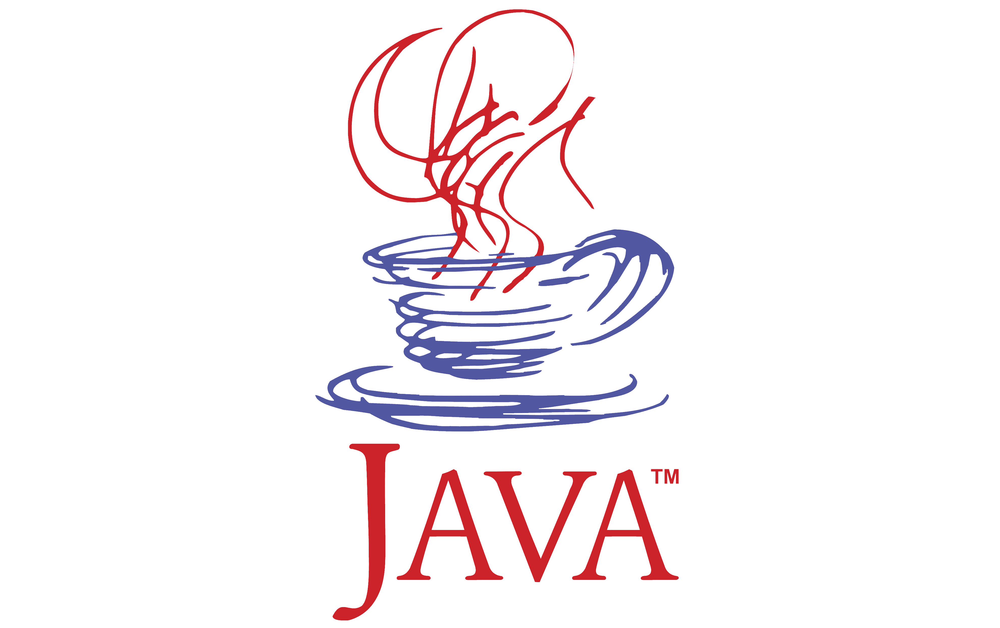
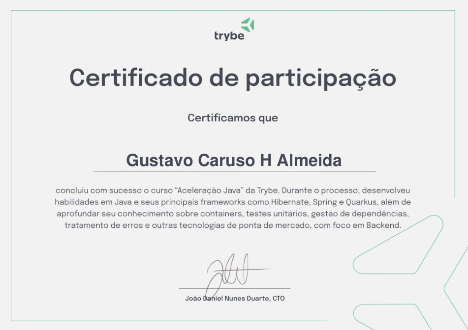

# Aceleração em Java

## Projetos desenvolvidos durante o curso
- <a target="_blank" href="https://github.com/gusttavocaruso/minhas-series">minhas-series</a>
- <a target="_blank" href="https://github.com/gusttavocaruso/simulador-de-pix">simulador-de-pix</a>
- <a target="_blank" href="https://github.com/gusttavocaruso/conversor-csv">conversor-de-csv</a>
- <a target="_blank" href="https://github.com/gusttavocaruso/sistema-de-votacao">sistema-de-votacao</a>
- <a target="_blank" href="https://github.com/gusttavocaruso/controle-de-acesso">controle-de-acesso</a>

#### **Projeto final**
- <a target="_blank" href="https://github.com/gusttavocaruso/measure-shelter">measure-shelter</a>

---

Repositório de curso de JAVA promovido pela [Trybe](https://www.betrybe.com/) em parceria com a [CI&T](https://ciandt.com/br/pt-br/home) ©

